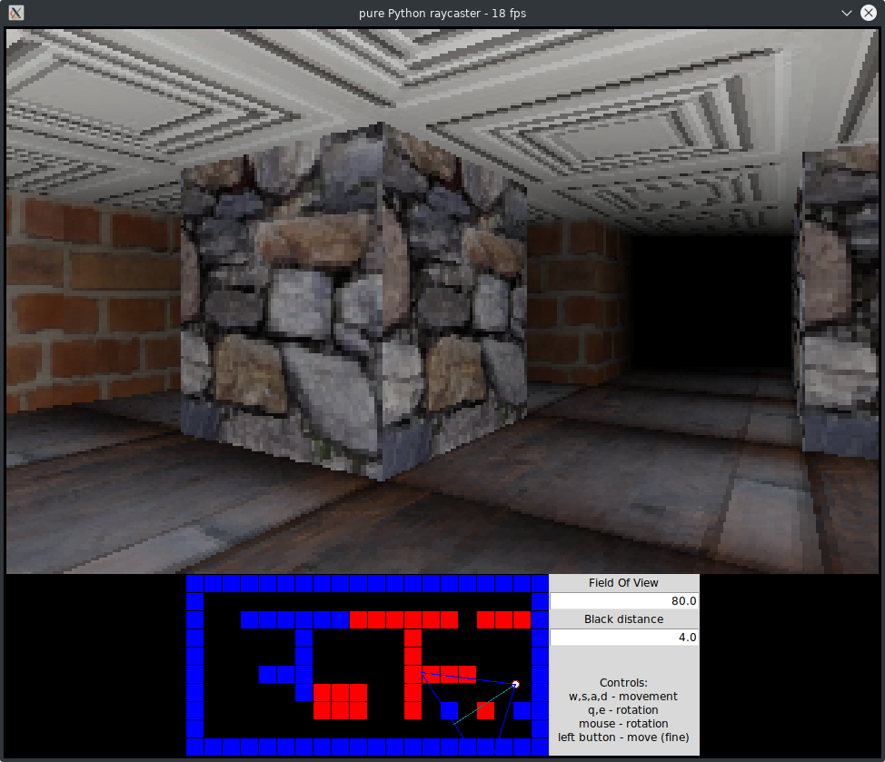

# Raycaster engine in Python

This is an attempt at a Python 3 implementation of a classic raycaster. Think original DOS Wolfenstein.
However, this version also has a texture mapped floor and ceiling, something that
Wolfenstein lacked!

Run this with any recent Python 3 version (tip: use Pypy for a huge performance boost):

    python -m pyraycaster
    
This implementation favors readability and simplicity over speed, because my main goal
is to learn how to build a raycaster engine, and not to create an actual playable game or something like that. 

*No 3d acceleration or third party graphics libraries are used.* 
The program uses just built-in Tkinter for the GUI and display, and Pillow to load the textures 
and provide a pixel image display.
On my system (Ryzen 2700 cpu, Linux) I get 10-20 fps when using regular CPython 
and around 60 fps when using Pypy!  This is with the default 160x100 resolution.

## Todo

- use a more efficient way to calculate the ray intersection with a map square
- use a more efficient ray trace algorithm that 'steps over squares' instead of actually tracing the ray using tiny steps
- interpolated texture sampling

# World coordinate system

The world is an infinite 2d plane built from squares. Each square measures 1x1 and
can either be a wall (of a certain texture) or an empty space.
The world should be fully enclosed so that rays always intersect with a wall.
 
The engine uses the regular mathematical axis orientation so the positive X axis is to the right,
and the positive Y axis is up.  This usually means the (0, 0) word map coordinate
corresponds to the bottom left corner in the minimap display on the screen.
The Z coordinate is not used at all because we are only able to draw corridors
that all have the same floor level and height.

# Camera ('player') position and viewing angle

The camera is just a 2d vector, it's viewing direction another 2d vector.
The length of the viewing direction vector doesn't matter.
The 'height' of the camera is simulated in the column draw phase where it
determines the height and position of the walls. Currently, the height of the
camera is exactly in the middle between ceiling and floor.
It is not possible to look up or down: you can only rotate the camera horizontally.
FOV can be adjusted to tweak the (horizontal) perspective.

You can use W,S,A,D to walk, and rotating is done with the mouse (or Q,E).

# Textures

All textures (walls, ceiling, floors) are squares of 64x64 pixels.
I settled on this rather small size considering the limited display size
of the screen as a whole: high res textures can't be displayed anyway.
